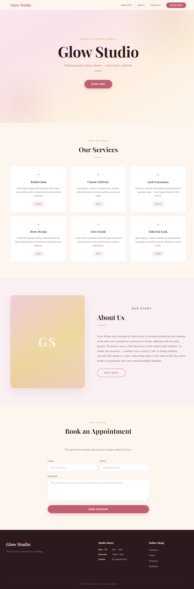
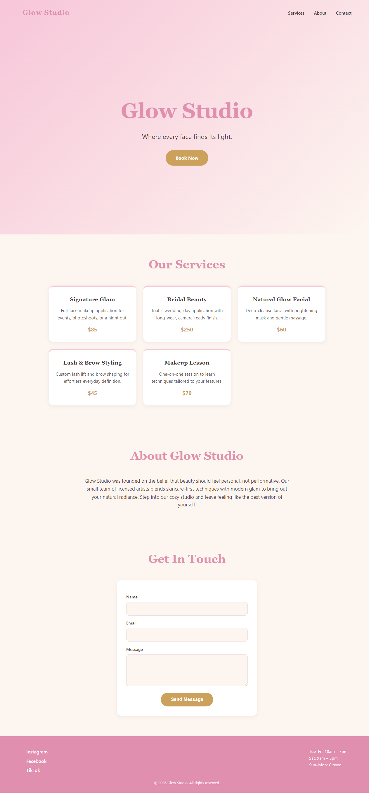

# Synapse — by The WhatIf Company

**Synapse is a command center for building apps with AI — and it's built for AI to drive, not just for a human to click around in.**

It runs on your computer as an always-on engine. You can put multiple AI coding assistants — **Claude**, **Codex**, **GitHub Copilot**, a **local model**, or any **MCP-compatible AI** — to work on your projects, watch and steer all of it from one window, and check in from your phone. Every AI that touches Synapse reads the same shared plan, the same project memory, and the same audit trail, so nothing gets lost between sessions and no two AIs step on each other.

Think of it as **mission control for your projects and your AI helpers** — one engine, many AIs, one source of truth.

> **Status:** early development (`v0.1.36.8`). It already launches projects, runs AI coding sessions, spins up AI teams ("squads"), and connects from your phone. We're actively building the unified AI coding cockpit, a shared cross-AI plan, and a one-click installer. **528 automated tests pass.**
>
> 📸 **[See what Synapse looks like →](./docs/screenshots/)** — real screenshots of the running app (Home, mobile, the AI Coding cockpit), refreshed as the UI evolves.

---

## Built for AI first. Great for humans too.

Most AI coding tools are built for a human to sit in front of and type into. Synapse flips that: **the primary user of Synapse's API is an AI**, and the desktop/phone windows are just a view into what the AI is doing. Concretely:

- **A single REST call (`GET /api/v1/ai/context`) tells any AI everything it needs to orient itself** — every project, every tool, every live session, the recent audit trail, and the exact list of endpoints meant for it to call next. No AI has to be told "here's how this app works" by a human first.
- **Every action is a documented, versioned REST/WebSocket call** (`/api/v1/...`), not a UI a model has to guess how to click through. An AI can create a project, launch a squad, or read a transcript with the same one-line `curl`/`fetch` a human developer would use.
- **State lives in the engine, not the session.** An AI that gets cut off, hits a usage limit, or crashes can come back — or a *different* AI can pick up — and read exactly where things stood, because the daemon (not the AI's own memory) is the source of truth.
- **Every AI-originated action is audited** (`audit_log`, Design Contract #11), so you can always see what an AI actually did, when, and through which call — not just what it *said* it did.

This is why the rest of this README talks about "AIs" as first-class operators of Synapse, right alongside "you."

---

## The 2-minute version (no jargon)

Say your friend is flipping clothes on Depop and asked an AI chatbot to help build them a simple site to track inventory and post listings faster. It worked... for about a day. Then:

- They came back the next morning and the AI had **forgotten what it built yesterday** — it re-explained the plan from scratch, or contradicted its own earlier decisions. That's **drift**.
- They asked it to add one small feature, and it **quietly rewrote something that already worked**, because it didn't have a durable memory of "don't touch that."
- They wanted to try a *different* AI (maybe a cheaper one, or one that's better at design) but couldn't hand it the same context — so they had to start over.
- Everything happened in one chat window. If they closed the laptop, the "session" was gone.

**Synapse exists to fix exactly this**, in plain terms:

1. **It remembers, for real.** Synapse keeps a project's plan, files, and history on disk in its own engine — not inside one AI's chat window. Close the app, reopen it a week later, and everything is exactly where it was.
2. **Any AI can pick up where another left off.** Claude built the storefront yesterday; today Codex can open the *same* project, read the *same* plan, and keep going — because the plan and the files live in Synapse, not in either AI's head.
3. **You watch it work instead of guessing.** You see what the AI is doing in real time — what files it touched, what it's running, what broke — instead of trusting a wall of chat text.
4. **It's safe by default.** Nothing destructive happens without confirmation. Every AI action is logged. You can always see exactly what changed.
5. **It works from your phone**, so you can kick off a build on your laptop, then check on it — or approve the next step — from the couch or the bus.

For your friend flipping clothes: instead of "chat with an AI and hope it remembers," it becomes "give Synapse the goal once, let an AI squad build it, watch progress from your phone, and trust that tomorrow's session starts from where today's left off" — whether that's a Depop inventory tracker, a simple storefront, or automated price-checking on competitors (more on that below).

If that's all you needed to know, skip to **[Getting started](#getting-started)**. Everything past this point gets more technical.

---

## What can I do with it, and why is it better than "just using an AI chatbot"?

- **🚀 Launch & manage your projects** — one place to start, stop, and watch every app or tool you're working on. Close the window and everything keeps running, because the engine (not the window) owns the process.
  *Why it's better:* a chatbot can write you code; it can't keep your app *running* and *monitored* after the chat ends. Synapse's daemon supervises the actual process — restart policy, health checks, resource use, logs — the same job a junior DevOps engineer would do.

- **🤖 Put AI to work** — run Claude, Codex, or Copilot directly on your code from inside Synapse. Give a task; the AI builds it. A shared **cross-AI plan** (`.synapse/plan.md` per project) keeps every AI on the same page — one can hand off to another mid-task and the new one won't repeat work or contradict earlier decisions.
  *Why it's better:* in a plain chat tool, "context" dies with the tab. In Synapse, the plan is a durable file the *project* owns — any AI, in any session, reads and updates the same document.

- **👥 Build AI teams ("squads")** — assemble a team of AI workers, each with a **role** (`boss` / `supervisor` / `worker` tier — planner, designer, reviewer, tester…) and a **personality** (five shipped built-ins: Pragmatist, Perfectionist, Skeptic, Visionary, Mediator), so they collaborate and challenge each other's decisions instead of one model rubber-stamping itself. A boss delegates to a supervisor, who delegates to workers, and each hands off with a structured summary — not a vague "done!".
  *Why it's better:* a single chatbot session is one voice checking its own work. A squad has a reviewer role whose whole job is to disagree when something's wrong, the same reason human teams do code review.
  *A worked example:* add the same `reviewer` role twice to a squad — once with the **Skeptic** personality, once with **Pragmatist** — and you get two AIs that read the same code and *disagree on purpose*: the Skeptic hunts for what's broken or unverified, the Pragmatist argues for shipping what's good enough now. That built-in tension is exactly what caught nothing in our own benchmark below — a lesson we're applying, not just describing.

- **🧑‍💼 An autonomous "AI boss"** *(ADR-0013)* — give it a goal from the Sessions quick-actions rail and it orients itself (`GET /api/v1/ai/context`), decides or creates the project, posts a visible plan, staffs and launches its own workers, prefers installing an existing marketplace tool over writing one from scratch, and records its decisions as project ADRs. Full autonomy, bounded by one thing: a **kill switch** (`POST /api/v1/agent-squads/{id}/stop`) that stops everything instantly.
  *Why it's better:* it doesn't just execute a task and forget — it writes durable ADRs and updates `.synapse-ai-context.md` as it goes, so the **next** run (next week, a different AI) starts smarter instead of re-deriving the same plan from zero. That's Synapse improving its own working knowledge, not just shipping one app.

- **🛒 A marketplace** — install tools, local AI models, MCP servers, workers, and ready-made teams with one click. Point-and-click for a human; a single `POST /api/v1/marketplace/install/{id}` for an AI.
  *Why it's better:* extending a chatbot means copy-pasting instructions into every new chat. Extending Synapse means installing a tool once — every future AI session (yours or a teammate's) sees it.

- **📱 Control it from your phone** — pair once, then start, stop, or approve AI work from anywhere over Wi-Fi or a secure tunnel.
  *Why it's better:* a chatbot session lives on the device you opened it on. Synapse's engine is the source of truth, so the phone is just another window onto the same live state as your desktop.

- **🧠 A built-in local AI** — an optional on-device assistant (via Ollama), so routine or sensitive work can run privately and for free, while hard problems still route to a frontier model.
  *Why it's better:* you're not paying frontier-model prices (or sending data off-device) for every trivial task.

- **🧭 A usage-aware auto-router** *(ADR-0022, in progress)* — Synapse picks the AI service, model, and effort level per task, and can auto-continue on a *different* AI (or wait for a reset) when one hits a usage limit — without you having to notice or intervene.
  *Why it's better:* a single chatbot subscription just stops working when you hit its limit. Synapse treats "which AI answers this" as a routing decision, not a hard wall.

---

## How it avoids AI drift, forgetting, and "context rot"

This is the headline problem with using AI to build real things solo: the AI is only as good as what fits in its current context window, and that context resets or degrades constantly. Synapse's answer isn't "give the model more context" — it's **stop keeping the state in the model at all.**

| Problem with plain AI chat | How Synapse avoids it |
|---|---|
| The AI forgets what it decided yesterday | The **shared plan** (`.synapse/plan.md`) and **project files** live on disk in the daemon. Any AI opens the project and reads the current state — it never has to "remember," it just reads. |
| Long sessions drift off the original goal | Squads use structured **handoffs** (`POST /agent-work-items/{id}/handoff`) with an explicit summary, blockers, files touched, and a suggested next role — appended to `.synapse-ai-context.md`. The next AI (or the next session of the *same* AI) starts from that summary, not from re-reading a mile of chat scrollback. |
| Switching AI tools means starting over | Every AI reads the **same** plan and project state through the same REST API (`GET /api/v1/ai/context`). Claude, Codex, and Copilot are interchangeable operators on the same project, not three separate memories. |
| You can't tell what the AI actually did | Every AI-originated action is written to an **audit log** (Design Contract #11) with its source. You can always reconstruct exactly what happened, in order — not rely on the AI's own account of itself. |
| One AI silently breaks something another AI built | The **multi-AI coordination protocol** (`docs/MULTI-AI-WORKFLOW.md`) requires a clean typecheck + test pass before any commit, git-status checks for another agent's in-flight work, and file-lane conventions so two AIs rarely touch the same file at once. |
| The AI hits a usage/rate limit mid-task and just stops | The usage-aware auto-router (ADR-0022) hands the task to another available AI, or schedules a resume at the detected reset time — automatically, using the same shared plan so nothing is lost in the handoff. |
| "It worked when the AI said so" isn't verifiable | Every version bump that changes behavior requires a **real end-to-end pass** (daemon boot → renderer load → click-through → verified screenshot) before it's considered done — not just "the AI says tests pass." |

The short version: **Synapse treats AI memory as a systems problem, not a prompting problem.** The fix isn't a cleverer prompt — it's a durable plan, a durable audit trail, and a protocol that any AI (this session or a future one, this model or a different one) can pick up cold and continue correctly.

---

## Build a business with Synapse (e-commerce, resale, services, anything)

Synapse isn't just for building the tools *you* use — it's a genuinely good way to have AI build and run the software behind a small business, because the same drift-avoidance and multi-AI handoff described above applies to a business's tools, not just to Synapse's own codebase.

Concrete, already-real example: the **Fast Money** marketplace tool (`tools/fast-money/`) does exactly this in one click — it spins up a private, local-first client-ops SaaS starter, installs an AI bundle (roles + personalities + recipes suited to running that kind of business), and opens an AI build session already pointed at it. You give it an app name and a one-line brief; a squad takes it from there.

Ways people use Synapse for a business, today:

- **Storefront / inventory tooling** — have a squad build and maintain a simple site for listing, pricing, and tracking inventory (the Depop/eBay/Etsy resale case). Because the plan persists, "add a sold-out badge" six weeks from now doesn't require re-explaining the whole app.
- **Competitor price-watching** — combine a squad with the installed **Web Scraper MCP** (see below) to monitor competitor listings and alert on price changes, new products, or restocks.
- **Lead / review monitoring** — scrape and summarize reviews, job postings, or business listings for market research before committing to a product line.
- **Landing pages & marketing sites** — a squad can go from a one-paragraph brief to a polished, mobile-responsive static site in one run (this is literally how the benchmark app below was built).
- **Ops automation** — schedule recurring scrapes/checks, generate reports, and hand off between AIs so the work continues even if you're not at the keyboard.

None of this requires you to know how to code. You describe the goal; the squad and its role-assigned AIs do the implementation, review, and handoff.

---

## Using the Web Scraper MCP through Synapse

Synapse's **fused automation MCP** (ADR-0022) is the owner's own general-purpose web scraper, wired in as a first-class, installable marketplace tool. Once installed, *any* AI operating inside Synapse — not just the one you're chatting with — can call it directly. It's proxied through the daemon (`GET/POST /api/v1/installed-pages/web-scraper/...`), so the renderer and any AI session talk to one trusted origin instead of hitting arbitrary external MCP servers.

What it can actually do, with concrete examples:

**Business & competitive intelligence**
- `extract_product_data` / `extract_deals` — pull structured product name/price/availability off a competitor's storefront to build a comparison table.
- `extract_business_intel` / `extract_company_info` / `get_tech_stack` — profile a competitor: what they sell, how they're built, what stack they run.
- `extract_reviews` / `extract_job_listings` — gauge customer sentiment or a competitor's hiring (a proxy for what they're building next).
- `monitor_page` + `schedule_scrape` + `flag_anomalies` — watch a competitor's pricing page on a schedule and get flagged the moment something changes.
- `compare_scrapes` — diff two points in time on the same page (e.g. "what changed on their pricing page since last week").

**Site health, security & compliance**
- `check_broken_links`, `score_security_headers`, `inspect_ssl`, `get_robots_txt` — a full health/security pass on your own storefront before launch.
- `scan_pii`, `test_oidc_security`, `decode_jwt_tokens` — check for accidental data leakage or auth weaknesses.

**Turning a live site into working code**
- `generate_react`, `generate_css`, `generate_sitemap`, `to_markdown`, `infer_schema` — scrape a reference site and generate a real starting component, stylesheet, sitemap, or TypeScript/JSON schema from what's actually on the page, instead of describing it from memory.

**Deep / authenticated / interactive scraping**
- `open_browser_session`, `click_browser_element`, `type_into_browser_element`, `fill_form`, `submit_scrape_credentials`, `take_screenshot` — drive a real logged-in browser session (e.g. pull data that's behind a login) step by step, with screenshots as proof.
- `crawl_sitemap`, `batch_scrape`, `map_site_for_goal` — bulk-map or bulk-scrape a whole site toward a stated goal, not just one URL at a time.

**API & data-shape reverse engineering**
- `find_graphql_endpoints`, `introspect_graphql`, `probe_endpoints`, `get_api_surface`, `get_api_calls` — figure out what API a site's frontend is *actually* calling, so you can build against the same data without scraping HTML at all.

**AI-driven, goal-based scraping**
- `run_agent` / `research_url` — hand the scraper a plain-English goal ("find their return policy and shipping costs") and let it figure out the navigation itself, instead of you writing selector logic.

Because this runs through Synapse's project/audit system, every scrape an AI runs is tied to a project, shows up in the audit trail, and its results land as project files the next AI session (or a human) can read — not a one-off answer that evaporates when the chat ends.

---

## Real benchmark: does Synapse actually help, or is this just a good pitch?

Rather than assert it, we measured it — using Synapse's own **built-in benchmark engine** (`daemon/synapse_daemon/benchmarks.py`, `/api/v1/benchmarks/*`), the same subsystem any Synapse project can use to compare AI runtimes on itself.

**The test:** build the identical small app from the identical spec, once *with* Synapse (a real Synapse project, a real Claude Code worker launched through Synapse's own project workbench) and once *without* Synapse (a single, memory-less, one-shot AI coding session — no plan file, no squad, no persistent project, the "just ask a chatbot" baseline). Same prompt, same scope, same model family, same machine. **Bonus honest finding:** the original plan was to launch the with-Synapse side through the full Agent Squads pipeline, and doing so surfaced a real, reproducible Windows bug in that launch path — we didn't hide it, we documented and worked around it. Full story in [`methodology.md`](./benchmarks/makeup-business-demo/methodology.md).

**The app:** "Glow Studio" — a small single-page static site for a fictional makeup/beauty business: hero section, a services list with prices, an about blurb, a working contact form (client-side only), and a footer — deliberately small so the benchmark itself stays cheap to run.

Full results, methodology, every raw file, and screenshots of both apps live in [`benchmarks/makeup-business-demo/`](./benchmarks/makeup-business-demo/) — nested by design (`apps/`, `results/tokens/`, `results/quality/` — one file per scored dimension, `screenshots/`, `raw-logs/`) so the numbers below are traceable back to source, not just asserted.

| Dimension | With Synapse | Without Synapse | Winner |
|---|---|---|---|
| UI/UX | 78 | 68 | With Synapse |
| Visual design | 90 | 46 | With Synapse |
| Code quality / architecture | 85 | 75 | With Synapse |
| Backend / functional correctness | 78 | **94** | **Without Synapse** |
| Usability & accessibility | 65 | 42 | With Synapse |
| Adversarial bug hunt | 42 | **96** | **Without Synapse** |
| **Average** | **73.0** | **70.2** | With Synapse, narrowly |
| Tokens used | ~16.1k | 51,314 |
| Time | 3m 8s active | 1m 47s |

**The single pass above is not a clean sweep, on purpose — we're not going to pretend it was.** The Synapse-built app is the more ambitious, better-designed result: real custom typography instead of system fonts, a full 10-color design-token system instead of 5 flat colors, a working mobile menu instead of none. It wins 4 of 6 dimensions clearly. But it also shipped two real, live-reproduced bugs the simpler build didn't have — a contact form that silently "succeeds" on a completely blank submission, and a mobile nav menu that visibly overlaps the header on small screens. Both are exactly the kind of defect an actual **reviewer role** (a second AI whose job is to check the first one's work — see "Build AI teams" above) would very plausibly have caught, and that first run didn't use one (squad launch was broken on Windows at the time).

**Then we actually ran the reviewer pass — and it wins every category.** Once the Windows squad-launch bug was fixed, a reviewer pass fixed those two bugs (verified live in a browser: empty submits are now blocked; the mobile nav no longer overlaps or blocks the hamburger), and a fresh head-to-head re-score flipped both losing dimensions:

| Dimension | With Synapse **+ reviewer** | Without Synapse | Winner |
|---|---|---|---|
| Backend / functional correctness | **100** | 88 | **With Synapse** |
| Adversarial bug hunt | **98** | 70 | **With Synapse** |
| (the other four, unchanged) | 78 · 90 · 85 · 65 | 68 · 46 · 75 · 42 | With Synapse |
| **Average (all six)** | **86.0** | **64.8** | **With Synapse — all six** |

So the honest arc is the real story: **a single unreviewed AI pass is strong but ships bugs; Synapse's reviewer differentiator catches and fixes them, winning every category — at build+review tokens still under the baseline's 51,314.** Full breakdown, the re-score, every bug, and both apps' full source: [`benchmarks/makeup-business-demo/results/quality/summary.md`](./benchmarks/makeup-business-demo/results/quality/summary.md) · [`reviewed-rescore.md`](./benchmarks/makeup-business-demo/results/quality/reviewed-rescore.md).

| With Synapse | Without Synapse |
|---|---|
|  |  |

We scored quality across independent dimensions instead of one number, because "quality" isn't one thing:

- **UI/UX** — is the interface usable, are interactions clear, does it behave correctly on mobile and desktop?
- **Visual design** — polish, color/typography cohesion, whether it looks like a real brand or a wireframe.
- **Code quality / architecture** — readability, structure, whether a human developer could maintain it.
- **Backend / functional correctness** — does everything that's supposed to work, actually work?
- **Usability & accessibility** — can a real, non-technical visitor use it without friction?
- **Bugs found** — an independent pass specifically hunting for defects, counted and listed, not estimated.

This is a small, single-run benchmark on a small app — treat it as one honest data point, not a universal law. Synapse's benchmark engine is built to run this same comparison, with repeats and confidence labels, on *your* real projects too.

---

## What's been built with Synapse

- **The "Glow Studio" benchmark app** above — a full small business landing page, built end-to-end by a Synapse squad from a one-paragraph brief.
- **Fast Money** (`tools/fast-money/`) — a one-click, private, local-first client-ops SaaS starter, including an installed AI bundle, ready for a squad to extend into a real product.
- **Synapse itself** — the desktop app, the daemon, the mobile view, and this README were all built and are actively maintained by AI coders (Claude, Codex, Copilot) working inside the same conventions this document describes, dogfooding the multi-AI workflow on its own codebase (see `docs/MULTI-AI-WORKFLOW.md`).

---

## Getting started

**Just want to use it?** Double-click **`synapse.cmd`** — it starts everything and opens the window. Close the window and it tucks into your system tray; right-click the tray icon → **Quit Synapse** to fully close. To put a shortcut on your desktop, run **`install-shortcut.cmd`** once.

**Connecting your phone:** in the app open **Settings → Phone Access**, then scan the QR code with your phone. That's it — you're connected.

---

## How it works (the simple version)

Synapse has two parts that talk to each other:

1. **The engine** — a small, always-on background program (a Python "daemon") that does the real work: it launches your apps, runs the AI sessions, and keeps everything alive on port `7878`.
2. **The windows** — the desktop app and the phone view are just *screens* into that engine. You can close them anytime and your work keeps running; open them back up and you're right where you left off.

That's why Synapse is dependable: the screens can come and go, but the engine never drops your work.

---

## For developers

```powershell
# one-time setup
npm install
pip install -e ".[dev]"

# checks
npm run typecheck                 # TypeScript passes
(cd daemon && python -m pytest -q) # 528 tests pass + 12 skipped

# run the dev stack (daemon + Vite + Electron)
synapse.cmd
```

Before any AI coder (or you) starts a change, run `pwsh -NoProfile -File scripts/preflight.ps1` — it prints the next ADR/migration numbers to claim and flags if the uncommitted diff is getting too big to be one clean commit.

| Layer | Stack |
|---|---|
| Desktop UI | Electron 31 · Vite · React 18 · TypeScript · Tailwind · shadcn/ui |
| Engine | Python 3.11+ · FastAPI · uvicorn · psutil · Pydantic · SQLite (numbered migrations) |
| Comms | REST + WebSocket on `localhost:7878`, prefixed `/api/v1` |
| Tunnels | Cloudflare (`cloudflared`) for phone-over-internet |
| Packaging | PyInstaller (engine) · electron-builder + NSIS (installer) |

- **Repo conventions, the 28 design contracts, and the cross-AI workflow** → [`AGENTS.md`](./AGENTS.md)
- **Architecture decisions** → [`docs/adr/`](./docs/adr/) (latest: ADR-0022, one Synapse + the coding cockpit + the usage-aware auto-router)
- **What shipped** → [`CHANGELOG.md`](./CHANGELOG.md) · **Where we are** → [`PROGRESS.md`](./PROGRESS.md) · **Where we're headed** → [`docs/roadmap.json`](./docs/roadmap.json) (also shown in-app under **What's New**)

### How any AI can connect to Synapse

Synapse doesn't have a closed integration story — any AI that can make an HTTP call or speak MCP can operate it.

**In simple terms:** if a friend's AI assistant can browse the web or run commands, it can talk to Synapse — Synapse just needs to be running (`synapse.cmd`), and the AI needs the local address (`http://localhost:7878`) and a token from **Settings**. From there, that AI can see your projects, launch work, and read results, the same as Claude or Codex do inside Synapse today.

**In developer terms:**
1. **As an MCP tool consumer** — install a marketplace tool and any MCP-aware client can call it; the daemon proxies the calls so the client never needs the tool's own credentials.
2. **As a squad worker** — any CLI-based coding agent can be registered as a `preferred_runtime` on an `agent-role-template` (`POST /api/v1/agent-role-templates`) and launched the same way Claude/Codex/Copilot are (`POST /api/v1/agent-work-items/{id}/launch`), which injects `SYNAPSE_SQUAD_ID` / `SYNAPSE_WORK_ITEM_ID` / `SYNAPSE_API` / `SYNAPSE_TOKEN` into its environment so it can read/write back into the same project.
3. **As a direct REST/WS client** — authenticate with `X-Synapse-Token` (from `GET /api/v1/auth/local-token` locally, or a paired token remotely), start at `GET /api/v1/ai/context` for a full orientation digest, then drive projects, files, squads, coder threads, and benchmarks through the same versioned `/api/v1/...` surface the UI uses. Every endpoint and event is documented and changelogged in [`docs/api-changes.md`](./docs/api-changes.md).
4. **As a local model** — Ollama models are supported as a built-in runtime option for private, free, on-device work, routed the same way as any other coder.

See [`AGENTS.md` → "AI-facing surfaces"](./AGENTS.md) for the full list of endpoints meant specifically for AI callers (project files, transcripts, quick-actions, marketplace install, and more).

### Repo layout

```
electron/    Desktop app shell (Electron main + preload)
renderer/    The React UI (desktop + the phone view)
daemon/      The Python engine — owns all the real work + state
tools/       Drop-in plugins (a folder + a manifest.json, no UI surgery)
docs/        Architecture decisions (adr/), API notes, roadmap
scripts/     Dev, recovery, build, and preflight helpers
installer/   Packaging config
benchmarks/  Real, reproducible benchmark runs (nested: apps/, results/, screenshots/, raw-logs/ per run)
```

### Recovering phone access without the desktop app

If the desktop UI is down but you still have shell access to the machine:

```powershell
powershell -NoProfile -ExecutionPolicy Bypass -File .\scripts\remote-recovery.ps1
# add -InstallCloudflared the first time if cloudflared isn't installed
```

It starts (or reuses) the engine, opens a Cloudflare tunnel on `7878`, and prints the phone URL + a fresh pairing code.

## License

All rights reserved — see [`LICENSE`](./LICENSE).

---

**Synapse** is a product of **The WhatIf Company** — building the tools that let anyone — and any AI — create software.
