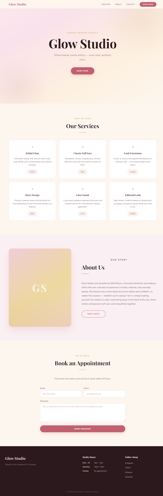

# Synapse — by The WhatIf Company

**Synapse is a command center for building apps with AI — and it's built for AI to drive, not just for a human to click around in.**

It runs on your computer as an always-on engine. You can put multiple AI coding assistants — **Claude**, **Codex**, **GitHub Copilot**, a **local model**, or any **MCP-compatible AI** — to work on your projects, watch and steer all of it from one window, and check in from your phone. Every AI that touches Synapse reads the same shared plan, the same project memory, and the same audit trail, so nothing gets lost between sessions and no two AIs step on each other.

Think of it as **mission control for your projects and your AI helpers** — one engine, many AIs, one source of truth.

> **Status:** early development (`v0.1.204`). It already launches projects, runs AI coding sessions, spins up AI teams ("squads"), connects from your phone, and gives operators a live, trustworthy picture of what their AIs are doing. The newest release isolates MCP connector dispatch onto a dedicated bounded executor, returns retryable 503 immediately instead of silently queueing when saturated, and exposes queue-versus-execution timing without logging arguments or secrets. The preceding release gives ChatGPT UI workers durable conversation identity, project/request grouping, active/idle/error presence, per-turn work-time accounting, a canonical project chat pointer, safe dedicated browser setup, and Live View visibility; it also hardens generic MCP forwarding for nested Playwright/Reflex arguments. The preceding release adds Stock Hunter as a native portable Synapse skill and quick action with evidence-gated screening/scoring helpers. The preceding release turns AI-filed improvement proposals into a durable backlog with separate human-decision and implementation-lifecycle state, evidence-backed automatic progress detection, and direct Review controls. The preceding release restores the staged multi-AI coordination gate's authenticated overlap check: `coordination-preflight.ps1 -Staged` now reads Synapse's trusted-local token when callers use the documented no-token invocation, instead of receiving 401 and silently degrading to numbering-only. The preceding release fixes the Home featured-app card keeping a stale `not running` badge when a failed launch has already changed backend truth -- specifically, launching RackPilot while its port 5089 is already served by an outside process makes the backend mark it running and return a conflict; Home now refetches that project in the catch path and immediately shows the authoritative running state without restarting the daemon. The preceding release fixes `scripts/dev.ps1` spawning an unbounded number of duplicate daemon/tunnel watchdog processes -- every restart added another detached, hidden pair without checking whether one from an earlier restart was still alive, since both watchdogs deliberately outlive the process tree they started alongside. Confirmed live after a real internet outage: 7 duplicate tunnel-watchdogs and 7 duplicate daemon-watchdogs were all running at once, independently racing to "fix" the same tunnel. Fixed with a process-presence check before either watchdog starts. The preceding release closes the last real gap behind the "502 that looks like a wedge but isn't": `synapse_run_command` blocked its whole HTTP request for the command's full duration, which risked a proxy/tunnel's own gateway timeout (commonly under two minutes) killing the connection with a bare 502 on anything slow, even with the daemon itself perfectly healthy -- confirmed live against the actual NabSignal ChatGPT build thread, where the daemon process never restarted but one long command still 502'd. Added `synapse_run_command_async` + `synapse_get_command_result` so a command's actual duration never has to fit inside any proxy's timeout window, and hard-capped the sync tool's own timeout at 90s (from 900s) so anyone who doesn't switch over still gets a clean, fast timeout instead of an opaque 502. The preceding release fixes the WAN/`public_hostname` health probe sending no `User-Agent` -- Cloudflare's bot protection blocks Python's default `Python-urllib/x.y` UA outright, so a real, working, already-verified-by-curl tunnel was reported as `HTTP 403` by Synapse's own verification; fixed by sending a normal browser-shaped UA. The preceding release adds a `public_hostname` setting so an operator who already runs their own stable tunnel or reverse proxy to this daemon (a named cloudflared tunnel, for example) can tell Synapse its hostname once, in Settings -- it's then used for the MCP connector URL and remote-access status instead of Cloudtap's own auto-generated quick-tunnel, which gets a brand new random hostname every restart and previously meant re-copying the connector URL into ChatGPT/Claude's settings after every restart. Also fixed a real bug in the same area: the "Full access" toggle for the MCP connector double-JSON-encoded its request body and failed on every click. The preceding release fixed the actual root cause of the daemon "wedge" as hit through the MCP connector that a remote AI coding agent (Claude, ChatGPT) actually drives Synapse through (`daemon/synapse_daemon/mcp_connector.py`): `POST /mcp/{token}` ran its entire tool-dispatch chain synchronously with no thread offload, and the `synapse_run_command` tool -- what a coding agent uses to run shell commands -- calls a plain blocking `subprocess.run` with up to a 900s timeout inside that chain, freezing the whole daemon event loop (including its own health check) for however long the command took. Read-only calls were fast enough to hide it; any real write/coding command reliably froze the daemon and 502'd every other in-flight request. Fixed by offloading the dispatch to a worker thread via `asyncio.to_thread`. The preceding release fixed a real but secondary bug in the same area (`daemon/synapse_daemon/process_manager.py`): launching any managed project called a blocking `subprocess.Popen(shell=True, ...)` directly on the event loop thread instead of a background thread, and on Windows that spawn can stall for several seconds under real-time AV scanning -- long enough to freeze every other request the daemon was serving, including MCP tool calls routed through the ChatGPT connector, which read as a transient 502 with no obvious cause. Now offloaded via `asyncio.to_thread`, matching the pattern `stop()` already used. The same release raises the tray restart flow's daemon health-check timeout (`electron/main.ts`) from 15s to 30s -- it had essentially no margin over the daemon's own typical cold-start time, so ordinary machine load could trip a `SYN-BOOT-102` ("did not become healthy in time") error even though the daemon went on to start successfully moments later. The preceding release makes "Scan for projects" actually useful out of the box: the root field always started blank, so nothing on disk was found until you remembered to type a path in -- it now defaults to whichever directory the most already-registered projects have in common (in practice, your dev-projects home), computed from what Synapse already knows. Closes the real gap that meant RackPilot, sitting right under that same home directory, was never found by a scan. Two real bugs were caught landing this: a strict "everyone must share this exact prefix" comparison that a single relative-path project zeroed out completely (replaced with a majority vote so one outlier can't blank out an obvious answer), and a `useEffect`-based version that lost a race against the daemon's initial project-list fetch (replaced with a render-time `useMemo`, which can't race since it always reads the current data). The preceding release fixes a project registered, edited, or deleted outside the currently-open Apps page's own form (a direct API call, a future discovery-scan path) never showing up in an already-open window until its next manual reload -- `POST`/`PATCH`/`DELETE /projects` never published a `v1.project.*` WebSocket event, which is the only thing that makes an open window refresh its project list; hit live when a newly-registered project (RackPilot) didn't appear in an already-open window. Now publishes `created`/`updated`/`deleted` events via the same event-bus pattern already used elsewhere. The preceding release fixes clicking outside a modal (project detail, the project form, confirm dialogs) not closing it -- root-caused live to React's own synthetic `onClick` silently never firing on the backdrop element even though the real native click event demonstrably fires and bubbles correctly; fixed with a native `addEventListener`, the same pattern this component already used for Escape-key handling, verified with real clicks before and after. The same release changes the Apps page's default sort from alphabetical to most-recent-activity-first (pinned projects still float to top), so an app you use constantly doesn't sit below one you touched once months ago. The preceding release adds another real reliability fix to the ChatGPT-web coder runtime (`daemon/synapse_daemon/chatgpt_browser_runtime.py`): a conversation can hit ChatGPT's own hard length ceiling ("You've reached the maximum length for this conversation") -- a permanent condition, not a stall, confirmed happening for real the same night as the send-verification fix below -- and left undetected this used to mean silently waiting out the full 20-minute reply timeout for a message a maxed-out conversation can never send. `conversation_length_limit_reached()` now checks for this both before a send is attempted and while waiting for a reply, surfacing a specific, actionable error ("branch to a new conversation before continuing") the moment it's detected. Deliberately does not automate the branch itself -- that's a human/Claude-driven browser action found unreliable enough on a heavily-loaded tab that it isn't shipped without being provable live first. The preceding release makes the Apps page's project tiles actually short: they used to show kind/group/tags, a description, a cmd/port/disk/cpu-ram table, and two full rows of action buttons inline, forcing endless scrolling to see more than a couple of apps -- now a tile shows just name, path, status, and the two actions people reach for constantly (Launch/Stop, Open in browser), with everything else moved into the detail modal that already opened on a tile click (measured live: tiles dropped from ~250-350px+ to ~120-133px). The same release fixes "Open in browser" silently missing on any app registered without an expected port (the field is optional) -- the button is now always shown, just disabled with a tooltip naming the exact fix, instead of vanishing with no explanation. Also caught and fixed live: a real app (RackPilot) was found completely absent from the registry and is now registered, exercising both fixes end to end against a genuinely new project rather than only the existing 32. The preceding release fixes a real reliability gap in the ChatGPT-web coder runtime (`daemon/synapse_daemon/chatgpt_browser_runtime.py`): sending a prompt trusted a `type()`/Enter-press call succeeding as proof the message actually reached ChatGPT, but a stale or unfocused composer (e.g. right after a navigation) can silently receive nothing while those calls still report success -- confirmed happening for real driving this exact chatgpt.com UI in a sibling project's build loop, where a "continue" nudge appeared to work but never actually landed, leaving both sides idle with no visible error until caught by hand. Every send is now verified before (composer content read back and compared to what was typed) and shortly after (the stop button appears or the composer clears, within 12 seconds) sending, with one automatic retry from a cleared composer before giving up -- a failed send now surfaces a clear diagnostic in seconds instead of silently waiting the full 20-minute reply timeout for a reply that was never coming. The preceding release fixes a real race condition in dev mode's window creation (`electron/main.ts`): `mainWindow.loadURL('http://localhost:5173')` had zero retry, so a dev server that briefly refused a connection moments after `dev.ps1`'s own readiness check passed would permanently fail the interface load with no recovery -- the console would stall right after "Launching Electron" with no further sign of life, and a separate 45s timer would then also report the interface never became ready. Reproduced live (running Electron standalone before Vite was up produced the exact `ERR_CONNECTION_REFUSED`), fixed with a 5-attempt retry that only retries transient connection failures, verified by a fresh launch loading the full dashboard on the first attempt. The preceding release fixes a real bug in Cloudtap's tunnel-URL parsing (`daemon/synapse_daemon/tools/cloudtap.py`): its regex could mistake `api.trycloudflare.com` -- Cloudflare's own fixed control-plane hostname, printed by `cloudflared` in an error line when a quick-tunnel request fails, most commonly during a network outage -- for the real assigned tunnel hostname, reporting a "live" tunnel that actually pointed at Cloudflare's real API (HTTP 405 on every request) instead of the local daemon; found live via WAN auto-start's own remote-access verification after a real internet outage, fixed by excluding that exact hostname from the regex. The preceding release fixes the same false-positive self-termination bug in the daemon watchdog itself (`scripts/daemon-watchdog.ps1`) that v0.1.183 fixed in the tunnel watchdog -- its grace window was actually shorter than its own check interval, so a slow restart under load could read as an intentional stop and leave the daemon completely unprotected; now requires multiple consecutive confirmations first, same as the tunnel watchdog. The preceding release fixes a real false-positive in the tunnel watchdog itself (`scripts/tunnel-watchdog.ps1`): it could mistake a single "nothing listening yet" moment during the daemon watchdog's own restart cycle for an intentional shutdown and exit for good, leaving the tunnel unwatched -- confirmed happening live, fixed by requiring the same multi-check confirmation already used for its reachability check. The preceding release added that companion watchdog for the persistent Cloudflare Tunnel itself -- nothing previously restarted `cloudflared` if it crashed, so the daemon could stay perfectly healthy while every MCP connector went completely dark with no automatic recovery; verified against a real kill, not just a syntax check, restoring the tunnel automatically within seconds. Before that, two real bugs in the daemon watchdog itself were fixed the same day it shipped: a restart-path failure that could silently kill the whole watchdog process, and (found only by continuing to watch after that first fix) a log-write ordering bug that silently skipped the actual kill+relaunch on every attempt. Earlier still, the daemon's random-hostname-per-restart Cloudflare quick tunnel was replaced with a persistent named tunnel (`synapse.whatapc.com`) -- the hostname now never changes across restarts, and `scripts/dev.ps1` brings it up automatically. Earlier releases: `synapse_watch_repo`, a Home page fetch-error fix, a `token-lean-delegation` playbook, `default_execution_mode` for headless agent-role workers, `synapse_quality_summary` and `synapse_get_project_ai_context` MCP tools, a wall-clock deadline on the coder-runtime ladder's overnight retries, `synapse_web_search`, a `synapse_runtime_status` quota-reporting fix, ChatGPT shipping as a real autonomous coder runtime, and the playbooks system itself — see `CHANGELOG.md` for the full, unabridged history.
>
> 📸 **[See what Synapse looks like →](./docs/screenshots/)** — real screenshots of the running app (including Deep Live View and the verified restart checklist), refreshed as the UI evolves.

---

## Built for AI first. Great for humans too.

Most AI coding tools are built for a human to sit in front of and type into. Synapse flips that: **the primary user of Synapse's API is an AI**, and the desktop/phone windows are just a view into what the AI is doing. Concretely:

- **A single REST call (`GET /api/v1/ai/context`) tells any AI everything it needs to orient itself** — every project, every tool, every live session, the recent audit trail, and the exact list of endpoints meant for it to call next. No AI has to be told "here's how this app works" by a human first.
- **Every action is a documented, versioned REST/WebSocket call** (`/api/v1/...`), not a UI a model has to guess how to click through. An AI can create a project, launch a squad, or read a transcript with the same one-line `curl`/`fetch` a human developer would use.
- **State lives in the engine, not the session.** An AI that gets cut off, hits a usage limit, or crashes can come back — or a *different* AI can pick up — and read exactly where things stood, because the daemon (not the AI's own memory) is the source of truth.
- **Every AI-originated action is audited** (`audit_log`, Design Contract #11), so you can always see what an AI actually did, when, and through which call — not just what it *said* it did.

This is why the rest of this README talks about "AIs" as first-class operators of Synapse, right alongside "you."

---

## The 2-minute version (no jargon)

Say your friend is flipping clothes on Depop and asked an AI chatbot to help build them a simple site to track inventory and post listings faster. It worked... for about a day. Then:

- They came back the next morning and the AI had **forgotten what it built yesterday** — it re-explained the plan from scratch, or contradicted its own earlier decisions. That's **drift**.
- They asked it to add one small feature, and it **quietly rewrote something that already worked**, because it didn't have a durable memory of "don't touch that."
- They wanted to try a *different* AI (maybe a cheaper one, or one that's better at design) but couldn't hand it the same context — so they had to start over.
- Everything happened in one chat window. If they closed the laptop, the "session" was gone.

**Synapse exists to fix exactly this**, in plain terms:

1. **It remembers, for real.** Synapse keeps a project's plan, files, and history on disk in its own engine — not inside one AI's chat window. Close the app, reopen it a week later, and everything is exactly where it was.
2. **Any AI can pick up where another left off.** Claude built the storefront yesterday; today Codex can open the *same* project, read the *same* plan, and keep going — because the plan and the files live in Synapse, not in either AI's head.
3. **You watch it work instead of guessing.** You see what the AI is doing in real time — what files it touched, what it's running, what broke — instead of trusting a wall of chat text.
4. **It's safe by default.** Nothing destructive happens without confirmation. Every AI action is logged. You can always see exactly what changed.
5. **It works from your phone**, so you can kick off a build on your laptop, then check on it — or approve the next step — from the couch or the bus.

For your friend flipping clothes: instead of "chat with an AI and hope it remembers," it becomes "give Synapse the goal once, let an AI squad build it, watch progress from your phone, and trust that tomorrow's session starts from where today's left off" — whether that's a Depop inventory tracker, a simple storefront, or automated price-checking on competitors (more on that below).

If that's all you needed to know, skip to **[Getting started](#getting-started)**. Everything past this point gets more technical.

---

## What can I do with it, and why is it better than "just using an AI chatbot"?

- **🚀 Launch & manage your projects** — one place to start, stop, and watch every app or tool you're working on. Close the window and everything keeps running, because the engine (not the window) owns the process.
  *Why it's better:* a chatbot can write you code; it can't keep your app *running* and *monitored* after the chat ends. Synapse's daemon supervises the actual process — restart policy, health checks, resource use, logs — the same job a junior DevOps engineer would do.

- **🤖 Put AI to work** — run Claude, Codex, or Copilot directly on your code from inside Synapse. Give a task; the AI builds it. A shared **cross-AI plan** (`.synapse/plan.md` per project) keeps every AI on the same page — one can hand off to another mid-task and the new one won't repeat work or contradict earlier decisions.
  *Why it's better:* in a plain chat tool, "context" dies with the tab. In Synapse, the plan is a durable file the *project* owns — any AI, in any session, reads and updates the same document.

- **🛠 Improve Synapse from inside Synapse** — a bundled **Synapse Self** project points at the local repo, the **Improve Synapse** quick-action opens a real coder thread there, and guarded self-improvement endpoints expose a health report plus the first safe developer-loop test actions.
  *Why it's better:* the AI no longer needs a side-process or a fresh terminal ritual every time it wants to help Synapse itself. The same thread, review, benchmark, and project-record surfaces used for any other app can now be used on Synapse.

- **📡 Know the moment an AI connects — and watch it work** — every AI gets a **session number** (`#001…`) and an explained connection grade. **Deep View** is the default: current focus, deliberate reasoning summaries, decisions, searches/findings, evidence, clean Synapse/MCP/tool receipts, tokens, and correlated output. Click a real squad to see its visual worker topology, then click a worker for role, personality, runtime, status duration, task, sessions, MCP scope, and token evidence—all without leaving the page. Empty inspectors stay collapsed; **Summary View** hides the detail when you want a calmer story. Status badges explain themselves on hover and open a reason/remedy dialog on click.
  *Why it's better:* with a chatbot you infer what happened from a wall of text. Here the engine reports correlated identities and results, while explicitly separating connection health from work status and refusing to invent a blocker reason the AI never supplied.

- **👀 See what needs attention — and what was actually proven** — Home now shows a concise operator snapshot: review inbox count, AI-filed improvement backlog state, blocking quality gates, last test run, latest browser proof, and the latest successful review pass.
  *Why it's better:* an AI or human operator no longer has to hunt across Review, Quality, and thread history just to answer "what needs me?" or "how fresh is the proof behind this state?"

- **Use ChatGPT as a durable Synapse worker** - Synapse can keep a dedicated account-owner browser profile, create or resume real ChatGPT UI worker conversations inside the private `Synapse2GPT Workers` Project, remember the current chat pointer, and show thread status + cumulative worked time in Live View. The human-guided ChatGPT Companion remains available as a separate experimental capture surface.
  *Why it's better:* reconnecting or relaunching no longer means inventing a new worker identity. Synapse knows which conversation, request group, and work item the ChatGPT tab belongs to while keeping live connection leases separate.

- **👥 Build AI teams ("squads")** — assemble a team of AI workers, each with a **role** (`boss` / `supervisor` / `worker` tier — planner, designer, reviewer, tester…) and a **personality** (five shipped built-ins: Pragmatist, Perfectionist, Skeptic, Visionary, Mediator), so they collaborate and challenge each other's decisions instead of one model rubber-stamping itself. A boss delegates to a supervisor, who delegates to workers, and each hands off with a structured summary — not a vague "done!". Workers are pre-registered with a short-lived credential bound to their own session, task, and declared authority; they never inherit the desktop root token. Synapse keeps each launched worker visibly alive while its PTY is running, even during a long browser or MCP action.
  *Why it's better:* a single chatbot session is one voice checking its own work. A squad has a reviewer role whose whole job is to disagree when something's wrong, the same reason human teams do code review.
  *A worked example:* add the same `reviewer` role twice to a squad — once with the **Skeptic** personality, once with **Pragmatist** — and you get two AIs that read the same code and *disagree on purpose*: the Skeptic hunts for what's broken or unverified, the Pragmatist argues for shipping what's good enough now. That built-in tension is exactly what caught nothing in our own benchmark below — a lesson we're applying, not just describing.

- **🧑‍💼 An autonomous "AI boss"** *(ADR-0013)* — give it a goal from the Sessions quick-actions rail and it orients itself (`GET /api/v1/ai/context`), decides or creates the project, posts a visible plan, staffs and launches its own workers, prefers installing an existing marketplace tool over writing one from scratch, and records its decisions as project ADRs. Full autonomy, bounded by one thing: a **kill switch** (`POST /api/v1/agent-squads/{id}/stop`) that stops everything instantly.
  *Why it's better:* it doesn't just execute a task and forget — it writes durable ADRs and updates `.synapse-ai-context.md` as it goes, so the **next** run (next week, a different AI) starts smarter instead of re-deriving the same plan from zero. That's Synapse improving its own working knowledge, not just shipping one app.

- **🛒 A marketplace** — install tools, local AI models, MCP servers, portable AI skills, workers, and ready-made teams with one click. This includes **Warden** as an optional, version-pinned MCP search/router and **Super Internet Digger v2** as the first immutable, benchmark-backed skill pack. An AI can discover a skill through REST/MCP, read only the instructions/resources it needs, and still use GitHub, Playwright, Web Scraper, Warden, and every other direct tool normally. Enabled local stdio servers such as Reflex are labeled **Auto-attached · starts per AI**; Web Scraper remains an HTTP service that autoruns with Synapse. Point-and-click for a human; REST-callable for an AI.
  *Why it's better:* extending a chatbot means copy-pasting instructions into every new chat. Extending Synapse means installing a tool once — every newly launched Claude, Codex, or GitHub Copilot worker receives the role-scoped set automatically. Reflex stays isolated per worker instead of running one shared fixed-port controller.

- **🔄 A restart you can actually watch** — **Restart Synapse** now opens a focused progress window before anything exits, carries its state across the old and new desktop processes, and checks request acceptance, service shutdown, desktop relaunch, daemon health, and interface readiness. Failures stay visible with a stable `SYN-RST-*` / `SYN-BOOT-*` code and copyable diagnostics; the same lifecycle is observable through REST + WebSocket.
  *Why it's better:* the app no longer vanishes and asks you to guess whether it is restarting, stuck, or broken.

- **📱 Control it from your phone** — pair once, then start, stop, or approve AI work from anywhere over Wi-Fi or a secure tunnel. The WAN tunnel (via Cloudtap) now **auto-opens on startup by default** — a fresh install is reachable from anywhere out of the box; turn it off any time in Settings → Network (ADR-0026).
  *Why it's better:* a chatbot session lives on the device you opened it on. Synapse's engine is the source of truth, so the phone is just another window onto the same live state as your desktop.

- **🧠 A built-in local AI** — an optional on-device assistant (via Ollama), so routine or sensitive work can run privately and for free, while hard problems still route to a frontier model.
  *Why it's better:* you're not paying frontier-model prices (or sending data off-device) for every trivial task.

- **🧭 A usage-aware auto-router** *(ADR-0022, in progress)* — Synapse picks the AI service, model, and effort level per task, and can auto-continue on a *different* AI (or wait for a reset) when one hits a usage limit — without you having to notice or intervene.
  *Why it's better:* a single chatbot subscription just stops working when you hit its limit. Synapse treats "which AI answers this" as a routing decision, not a hard wall.

---

## How it avoids AI drift, forgetting, and "context rot"

This is the headline problem with using AI to build real things solo: the AI is only as good as what fits in its current context window, and that context resets or degrades constantly. Synapse's answer isn't "give the model more context" — it's **stop keeping the state in the model at all.**

| Problem with plain AI chat | How Synapse avoids it |
|---|---|
| The AI forgets what it decided yesterday | The **shared plan** (`.synapse/plan.md`) and **project files** live on disk in the daemon. Any AI opens the project and reads the current state — it never has to "remember," it just reads. |
| Long sessions drift off the original goal | Squads use structured **handoffs** (`POST /agent-work-items/{id}/handoff`) with an explicit summary, blockers, files touched, and a suggested next role — appended to `.synapse-ai-context.md`. The next AI (or the next session of the *same* AI) starts from that summary, not from re-reading a mile of chat scrollback. |
| Switching AI tools means starting over | Every AI reads the **same** plan and project state through the same REST API (`GET /api/v1/ai/context`). Claude, Codex, and Copilot are interchangeable operators on the same project, not three separate memories. |
| You can't tell what the AI actually did | Every AI-originated action is written to an **audit log** (Design Contract #11) with its source. You can always reconstruct exactly what happened, in order — not rely on the AI's own account of itself. |
| One AI silently breaks something another AI built | The **multi-AI coordination protocol** (`docs/MULTI-AI-WORKFLOW.md`) requires a clean typecheck + test pass before any commit, git-status checks for another agent's in-flight work, and file-lane conventions so two AIs rarely touch the same file at once. |
| The AI hits a usage/rate limit mid-task and just stops | The usage-aware auto-router (ADR-0022) hands the task to another available AI, or schedules a resume at the detected reset time — automatically, using the same shared plan so nothing is lost in the handoff. |
| "It worked when the AI said so" isn't verifiable | Every version bump that changes behavior requires a **real end-to-end pass** (daemon boot → renderer load → click-through → verified screenshot) before it's considered done — not just "the AI says tests pass." |

The short version: **Synapse treats AI memory as a systems problem, not a prompting problem.** The fix isn't a cleverer prompt — it's a durable plan, a durable audit trail, and a protocol that any AI (this session or a future one, this model or a different one) can pick up cold and continue correctly.

---

## Build a business with Synapse (e-commerce, resale, services, anything)

Synapse isn't just for building the tools *you* use — it's a genuinely good way to have AI build and run the software behind a small business, because the same drift-avoidance and multi-AI handoff described above applies to a business's tools, not just to Synapse's own codebase.

Concrete, already-real example: the **Fast Money** marketplace tool (`tools/fast-money/`) does exactly this in one click — it spins up a private, local-first client-ops SaaS starter, installs an AI bundle (roles + personalities + recipes suited to running that kind of business), and opens an AI build session already pointed at it. You give it an app name and a one-line brief; a squad takes it from there.

Ways people use Synapse for a business, today:

- **Storefront / inventory tooling** — have a squad build and maintain a simple site for listing, pricing, and tracking inventory (the Depop/eBay/Etsy resale case). Because the plan persists, "add a sold-out badge" six weeks from now doesn't require re-explaining the whole app.
- **Competitor price-watching** — combine a squad with the installed **Web Scraper MCP** (see below) to monitor competitor listings and alert on price changes, new products, or restocks.
- **Lead / review monitoring** — scrape and summarize reviews, job postings, or business listings for market research before committing to a product line.
- **Landing pages & marketing sites** — a squad can go from a one-paragraph brief to a polished, mobile-responsive static site in one run (this is literally how the benchmark app below was built).
- **Ops automation** — schedule recurring scrapes/checks, generate reports, and hand off between AIs so the work continues even if you're not at the keyboard.

None of this requires you to know how to code. You describe the goal; the squad and its role-assigned AIs do the implementation, review, and handoff.

---

## Driving Synapse from an AI

Another AI (a Claude Code session on this machine, or a remote AI over the WAN tunnel) can drive Synapse's
full capability — spin up squads, run workflows, harvest the web, register + evaluate an app — over the HTTP
API. Start with **[docs/DRIVE-SYNAPSE-FROM-AI.md](./docs/DRIVE-SYNAPSE-FROM-AI.md)** (task-oriented `curl`
flows) and the live schema at `GET /api/v1/openapi.json`. The daemon is token-guarded (`X-Synapse-Token`), and
the Cloudtap WAN tunnel auto-opens so it's reachable from anywhere (ADR-0026 / ADR-0027).

---

## Using the Web Scraper MCP through Synapse

Synapse's **fused automation MCP** (ADR-0022) is the owner's own general-purpose web scraper, wired in as a first-class, installable marketplace tool. Once installed, *any* AI operating inside Synapse — not just the one you're chatting with — can call it directly. It's proxied through the daemon (`GET/POST /api/v1/installed-pages/web-scraper/...`), so the renderer and any AI session talk to one trusted origin instead of hitting arbitrary external MCP servers.

The install/start path is now first-party too: on the owner's machine Synapse can detect a nearby trusted local checkout and auto-bootstrap it on startup; on a fresh GitHub install, Marketplace install can clone the official repo into `data/vendor/web-scraper`, install dependencies, register the MCP server, and auto-start it on later Synapse launches.

There is now also a **dedicated Web Scraper harvest workspace inside Synapse itself**: paste one or more authorized reference URLs, capture structure/style notes, generate React/CSS candidates, record provenance and adaptation mode, compare **reference -> generated -> adopted**, and save the artifacts straight back into a normal project's files.

What it can actually do, with concrete examples:

**Business & competitive intelligence**
- `extract_product_data` / `extract_deals` — pull structured product name/price/availability off a competitor's storefront to build a comparison table.
- `extract_business_intel` / `extract_company_info` / `get_tech_stack` — profile a competitor: what they sell, how they're built, what stack they run.
- `extract_reviews` / `extract_job_listings` — gauge customer sentiment or a competitor's hiring (a proxy for what they're building next).
- `monitor_page` + `schedule_scrape` + `flag_anomalies` — watch a competitor's pricing page on a schedule and get flagged the moment something changes.
- `compare_scrapes` — diff two points in time on the same page (e.g. "what changed on their pricing page since last week").

**Site health, security & compliance**
- `check_broken_links`, `score_security_headers`, `inspect_ssl`, `get_robots_txt` — a full health/security pass on your own storefront before launch.
- `scan_pii`, `test_oidc_security`, `decode_jwt_tokens` — check for accidental data leakage or auth weaknesses.

**Turning a live site into working code**
- `generate_react`, `generate_css`, `generate_sitemap`, `to_markdown`, `infer_schema` — scrape a reference site and generate a real starting component, stylesheet, sitemap, or TypeScript/JSON schema from what's actually on the page, instead of describing it from memory.

**Deep / authenticated / interactive scraping**
- `open_browser_session`, `click_browser_element`, `type_into_browser_element`, `fill_form`, `submit_scrape_credentials`, `take_screenshot` — drive a real logged-in browser session (e.g. pull data that's behind a login) step by step, with screenshots as proof.
- `crawl_sitemap`, `batch_scrape`, `map_site_for_goal` — bulk-map or bulk-scrape a whole site toward a stated goal, not just one URL at a time.

**API & data-shape reverse engineering**
- `find_graphql_endpoints`, `introspect_graphql`, `probe_endpoints`, `get_api_surface`, `get_api_calls` — figure out what API a site's frontend is *actually* calling, so you can build against the same data without scraping HTML at all.

**AI-driven, goal-based scraping**
- `run_agent` / `research_url` — hand the scraper a plain-English goal ("find their return policy and shipping costs") and let it figure out the navigation itself, instead of you writing selector logic.

Because this runs through Synapse's project/audit system, every scrape an AI runs is tied to a project, shows up in the audit trail, and its results land as project files the next AI session (or a human) can read — not a one-off answer that evaporates when the chat ends.

---

## Real benchmark: does Synapse actually help, or is this just a good pitch?

Rather than assert it, we measured it — using Synapse's own **built-in benchmark engine** (`daemon/synapse_daemon/benchmarks.py`, `/api/v1/benchmarks/*`), the same subsystem any Synapse project can use to compare AI runtimes on itself.

**The test:** build the identical small app from the identical spec, once *with* Synapse (a real Synapse project, a real Claude Code worker launched through Synapse's own project workbench) and once *without* Synapse (a single, memory-less, one-shot AI coding session — no plan file, no squad, no persistent project, the "just ask a chatbot" baseline). Same prompt, same scope, same model family, same machine. **Bonus honest finding:** the original plan was to launch the with-Synapse side through the full Agent Squads pipeline, and doing so surfaced a real, reproducible Windows bug in that launch path — we didn't hide it, we documented and worked around it. Full story in [`methodology.md`](./benchmarks/makeup-business-demo/methodology.md).

**The app:** "Glow Studio" — a small single-page static site for a fictional makeup/beauty business: hero section, a services list with prices, an about blurb, a working contact form (client-side only), and a footer — deliberately small so the benchmark itself stays cheap to run.

Full results, methodology, every raw file, and screenshots of both apps live in [`benchmarks/makeup-business-demo/`](./benchmarks/makeup-business-demo/) — nested by design (`apps/`, `results/tokens/`, `results/quality/` — one file per scored dimension, `screenshots/`, `raw-logs/`) so the numbers below are traceable back to source, not just asserted.

| Dimension | With Synapse | Without Synapse | Winner |
|---|---|---|---|
| UI/UX | 78 | 68 | With Synapse |
| Visual design | 90 | 46 | With Synapse |
| Code quality / architecture | 85 | 75 | With Synapse |
| Backend / functional correctness | 78 | **94** | **Without Synapse** |
| Usability & accessibility | 65 | 42 | With Synapse |
| Adversarial bug hunt | 42 | **96** | **Without Synapse** |
| **Average** | **73.0** | **70.2** | With Synapse, narrowly |
| Tokens used | ~16.1k | 51,314 |
| Time | 3m 8s active | 1m 47s |

**The single pass above is not a clean sweep, on purpose — we're not going to pretend it was.** The Synapse-built app is the more ambitious, better-designed result: real custom typography instead of system fonts, a full 10-color design-token system instead of 5 flat colors, a working mobile menu instead of none. It wins 4 of 6 dimensions clearly. But it also shipped two real, live-reproduced bugs the simpler build didn't have — a contact form that silently "succeeds" on a completely blank submission, and a mobile nav menu that visibly overlaps the header on small screens. Both are exactly the kind of defect an actual **reviewer role** (a second AI whose job is to check the first one's work — see "Build AI teams" above) would very plausibly have caught, and that first run didn't use one (squad launch was broken on Windows at the time).

**Then we actually ran the reviewer pass — and it wins every category.** Once the Windows squad-launch bug was fixed, a reviewer pass fixed those two bugs (verified live in a browser: empty submits are now blocked; the mobile nav no longer overlaps or blocks the hamburger), and a fresh head-to-head re-score flipped both losing dimensions:

| Dimension | With Synapse **+ reviewer** | Without Synapse | Winner |
|---|---|---|---|
| Backend / functional correctness | **100** | 88 | **With Synapse** |
| Adversarial bug hunt | **98** | 70 | **With Synapse** |
| (the other four, unchanged) | 78 · 90 · 85 · 65 | 68 · 46 · 75 · 42 | With Synapse |
| **Average (all six)** | **86.0** | **64.8** | **With Synapse — all six** |

So the honest arc is the real story: **a single unreviewed AI pass is strong but ships bugs; Synapse's reviewer differentiator catches and fixes them, winning every category — at build+review tokens still under the baseline's 51,314.** Full breakdown, the re-score, every bug, and both apps' full source: [`benchmarks/makeup-business-demo/results/quality/summary.md`](./benchmarks/makeup-business-demo/results/quality/summary.md) · [`reviewed-rescore.md`](./benchmarks/makeup-business-demo/results/quality/reviewed-rescore.md).

| With Synapse | Without Synapse |
|---|---|
|  |  |

We scored quality across independent dimensions instead of one number, because "quality" isn't one thing:

- **UI/UX** — is the interface usable, are interactions clear, does it behave correctly on mobile and desktop?
- **Visual design** — polish, color/typography cohesion, whether it looks like a real brand or a wireframe.
- **Code quality / architecture** — readability, structure, whether a human developer could maintain it.
- **Backend / functional correctness** — does everything that's supposed to work, actually work?
- **Usability & accessibility** — can a real, non-technical visitor use it without friction?
- **Bugs found** — an independent pass specifically hunting for defects, counted and listed, not estimated.

This is a small, single-run benchmark on a small app — treat it as one honest data point, not a universal law. Synapse's benchmark engine is built to run this same comparison, with repeats and confidence labels, on *your* real projects too.

### Benchmarking improved AI skills, not just apps

Portable skill packs now ship with the same evidence discipline. The first repeatable comparison, [`benchmarks/super-internet-digger/`](./benchmarks/super-internet-digger/), runs the original Codex v1 inspection helper and Synapse v2 on the same Windows machine, same fixtures, same Python runtime, and 15 alternating-order repeats. On the deliberately scoped 5,001-file offline inspection test, v2 measured **5.08x faster warm-engine execution**, **100/100 vs. 46.92/100 quality (+53.08 points)**, and **10.82x warm quality-adjusted throughput** with no observed critical safety regression.

The honest boundary matters: fresh-process CLI speed was only **1.45x**, and the complete internet/model workflow has **not** yet proven 4x. Its seven-scenario same-model/tool/access suite remains the release gate. Synapse records both passing and failing gates so a target cannot quietly turn into a marketing claim.

---

## What's been built with Synapse

- **The "Glow Studio" benchmark app** above — a full small business landing page, built end-to-end by a Synapse squad from a one-paragraph brief.
- **Fast Money** (`tools/fast-money/`) — a one-click, private, local-first client-ops SaaS starter, including an installed AI bundle, ready for a squad to extend into a real product.
- **Synapse itself** — the desktop app, the daemon, the mobile view, and this README were all built and are actively maintained by AI coders (Claude, Codex, Copilot) working inside the same conventions this document describes, dogfooding the multi-AI workflow on its own codebase (see `docs/MULTI-AI-WORKFLOW.md`).

---

## Getting started

**Just want to use it?** Double-click **`synapse.cmd`** — it starts everything and opens the window. Close the window and it tucks into your system tray; right-click the tray icon → **Quit Synapse** to fully close. To put a shortcut on your desktop, run **`install-shortcut.cmd`** once.

**Connecting your phone:** in the app open **Settings → Phone Access**, then scan the QR code with your phone. That's it — you're connected.

---

## How it works (the simple version)

Synapse has two parts that talk to each other:

1. **The engine** — a small, always-on background program (a Python "daemon") that does the real work: it launches your apps, runs the AI sessions, and keeps everything alive on port `7878`.
2. **The windows** — the desktop app and the phone view are just *screens* into that engine. You can close them anytime and your work keeps running; open them back up and you're right where you left off.

That's why Synapse is dependable: the screens can come and go, but the engine never drops your work.

---

## For developers

```powershell
# one-time setup
npm install
pip install -e ".[dev]"

# checks
npm run typecheck                 # TypeScript passes
(cd daemon && python -m pytest -q) # 1,049 tests pass + 14 skipped

# run the dev stack (daemon + Vite + Electron)
synapse.cmd
```

Before any AI coder (or you) starts a change, run `pwsh -NoProfile -File scripts/preflight.ps1` — it prints the next ADR/migration numbers to claim and flags if the uncommitted diff is getting too big to be one clean commit.

| Layer | Stack |
|---|---|
| Desktop UI | Electron 31 · Vite · React 18 · TypeScript · Tailwind · shadcn/ui |
| Engine | Python 3.11+ · FastAPI · uvicorn · psutil · Pydantic · SQLite (numbered migrations) |
| Comms | REST + WebSocket on `localhost:7878`, prefixed `/api/v1` |
| Tunnels | Cloudflare (`cloudflared`) for phone-over-internet |
| Packaging | PyInstaller (engine) · electron-builder + NSIS (installer) |

- **Repo conventions, the 28 design contracts, and the cross-AI workflow** → [`AGENTS.md`](./AGENTS.md)
- **Architecture decisions** → [`docs/adr/`](./docs/adr/) (latest: ADR-0031, observable whole-app restart lifecycle)
- **What shipped** → [`CHANGELOG.md`](./CHANGELOG.md) · **Where we are** → [`PROGRESS.md`](./PROGRESS.md) · **Where we're headed** → [`docs/roadmap.json`](./docs/roadmap.json) (also shown in-app under **What's New**)

### How any AI can connect to Synapse

Synapse doesn't have a closed integration story — any AI that can make an HTTP call or speak MCP can operate it.

**In simple terms:** if a friend's AI assistant can browse the web or run commands, it can talk to Synapse — Synapse just needs to be running (`synapse.cmd`), and the AI needs the local address (`http://localhost:7878`) and a token from **Settings**. From there, that AI can see your projects, launch work, and read results, the same as Claude or Codex do inside Synapse today.

**In developer terms:**
1. **As an MCP tool consumer** — install a marketplace tool and a compatible MCP host can call it. Synapse's built-in Claude, Codex, and GitHub Copilot launch adapters translate the same enabled, role-scoped server list into each host's session format automatically.
2. **As a squad worker** — any CLI-based coding agent can be registered as a `preferred_runtime` on an `agent-role-template` (`POST /api/v1/agent-role-templates`) and launched through `POST /api/v1/agent-work-items/{id}/launch`, which injects exact squad/work-item/project/runtime/PTY identity plus a short-lived, authority-scoped `SYNAPSE_TOKEN`. New runtimes need a small MCP translation adapter before Synapse can promise their installed MCP set too.
3. **As a direct REST/WS client** — authenticate once with `X-Synapse-Token` (from `GET /api/v1/auth/local-token` locally, or a paired token remotely), register through `/coordination/sessions`, retain its one-time `session_key`, and bind later attributed calls with `X-Synapse-Session` + `X-Synapse-Session-Key`. Start at `GET /api/v1/ai/context`, then drive the same versioned `/api/v1/...` surface the UI uses. Every endpoint and event is documented and changelogged in [`docs/api-changes.md`](./docs/api-changes.md).
4. **As a local model** — Ollama models are supported as a built-in runtime option for private, free, on-device work, routed the same way as any other coder.

See [`AGENTS.md` → "AI-facing surfaces"](./AGENTS.md) for the full list of endpoints meant specifically for AI callers (project files, transcripts, quick-actions, marketplace install, and more).

### Repo layout

```
electron/    Desktop app shell (Electron main + preload)
renderer/    The React UI (desktop + the phone view)
daemon/      The Python engine — owns all the real work + state
tools/       Drop-in plugins (a folder + a manifest.json, no UI surgery)
docs/        Architecture decisions (adr/), API notes, roadmap
scripts/     Dev, recovery, build, and preflight helpers
installer/   Packaging config
benchmarks/  Real, reproducible benchmark runs (nested: apps/, results/, screenshots/, raw-logs/ per run)
```

### Recovering phone access without the desktop app

If the desktop UI is down but you still have shell access to the machine:

```powershell
powershell -NoProfile -ExecutionPolicy Bypass -File .\scripts\remote-recovery.ps1
# add -InstallCloudflared the first time if cloudflared isn't installed
```

It starts (or reuses) the engine, opens a Cloudflare tunnel on `7878`, and prints the phone URL + a fresh pairing code.

## License

All rights reserved — see [`LICENSE`](./LICENSE).

---

**Synapse** is a product of **The WhatIf Company** — building the tools that let anyone — and any AI — create software.
