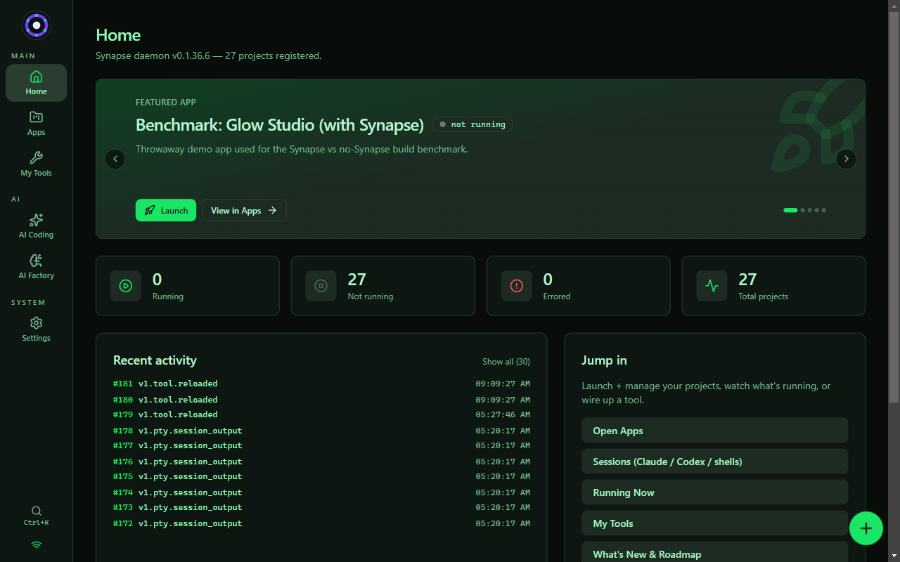
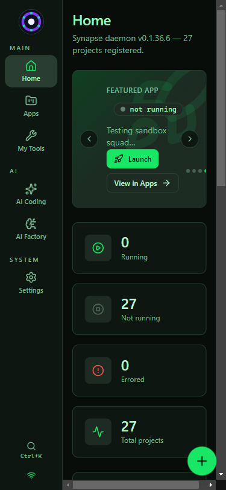
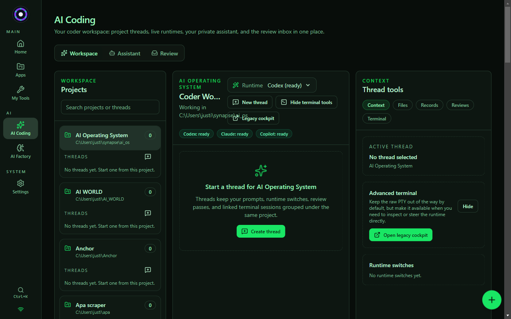

# Synapse — UI screenshots

Real screenshots of the running app, captured from the live renderer (Vite `:5173` + daemon `:7878`) via Playwright. **These evolve as Synapse is built** — when a change alters a user-visible surface, the affected image here is refreshed in the same commit (see the screenshot rule in `AGENTS.md`).

_Captured 2026-07-04 against daemon `v0.1.36.6`, 27 registered projects, 0 console errors (only a benign token-less-browser WS warning)._

## Home — mission control (desktop, 1280×800)

Featured-app slideshow, running/not-running/errored counts, live recent-activity feed, "Jump in" quick actions, and the "Built for AI agents too" panel. "Connected to daemon" — real data rendering.

## Home — mobile (375×812)

## AI Coding — the coder cockpit (desktop, 1280×800)

Project-thread workspace with a runtime picker (Codex / Claude / Copilot, all "ready"), thread tools (context / files / records / reviews / terminal), and the Assistant + Review tabs.

### Verified finding (2026-07-04) — feeds the cockpit work

The cockpit **works** (renders, connects, runtimes ready) but is **project-scoped only**: the left column is the list of registered projects, and you must select one before you can start a thread. There is **no project-free "New chat"** — no way to just start coding/chatting without first picking a project (or a "choose folder" / "General" bucket). This is exactly the gap flagged for the cockpit fix (project-free New chat), and it's captured in the session plan + `project-synapse-general-scope` memory. Not broken — missing the friction-free entry.
