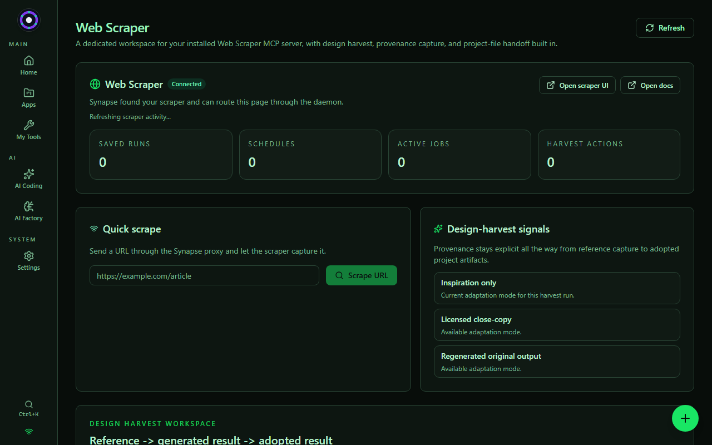
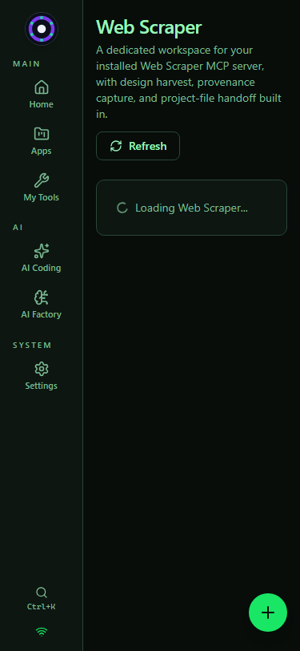

# Synapse — UI screenshots

Real screenshots of the running app, captured from the live renderer (Vite `:5173` + daemon `:7878`) via Playwright. **These evolve as Synapse is built** — when a change alters a user-visible surface, the affected image here is refreshed in the same commit (see the screenshot rule in `AGENTS.md`).

_Captured 2026-07-05 against daemon `v0.1.36.12`, 27 registered projects, with a connected local Web Scraper verification server. Browser console stayed clean aside from the existing benign token-less-browser WS warning._

## Home — mission control (desktop, 1280×800)

Featured-app slideshow, running/not-running/errored counts, live recent-activity feed, "Jump in" quick actions, and the "Built for AI agents too" panel. "Connected to daemon" — real data rendering.

## Home — mobile (375×812)

## AI Coding — the coder cockpit (desktop, 1280×800)

Project-thread workspace focused on the bundled **Synapse Self** project, showing the self-improvement cockpit and the review-driven coding surface where UX/QA/token-efficiency/judge passes live.

## Web Scraper — design harvest workspace (desktop, 1280×800)

The dedicated installed-page workspace for reference capture, provenance/adaptation labeling, generated component previews, and adopted project artifacts.

## Web Scraper — design harvest workspace (mobile, 375×812)

### Verified finding (2026-07-05) — feeds the cockpit work

The cockpit still **works** but remains **project-scoped only**: you pick a registered project first, then start a thread inside it. The new Synapse Self project makes that workable for self-improvement, but the project-free "New chat" idea is still a real future polish target rather than something this wave solved.
