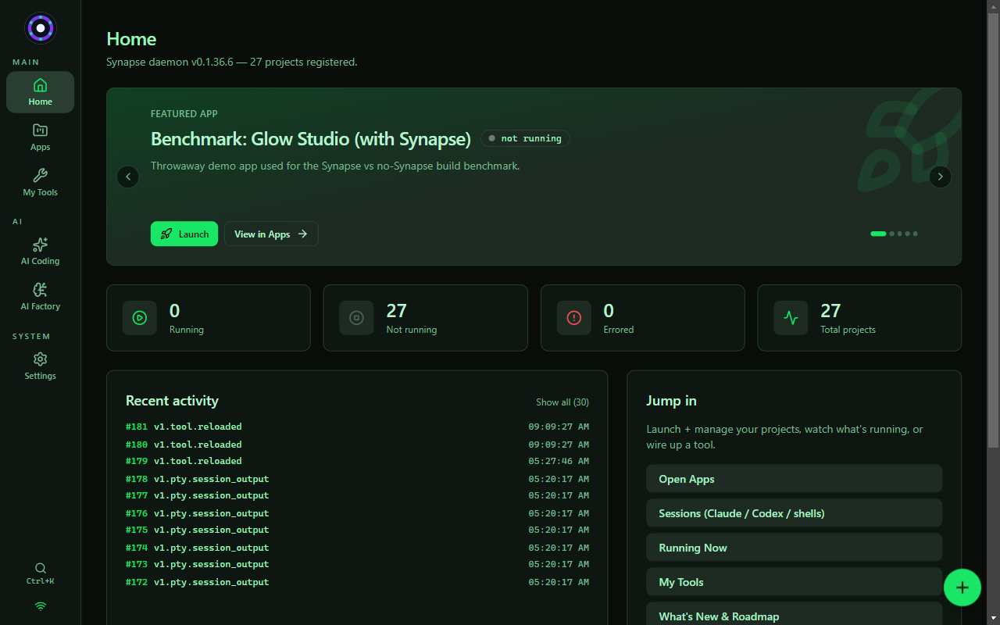
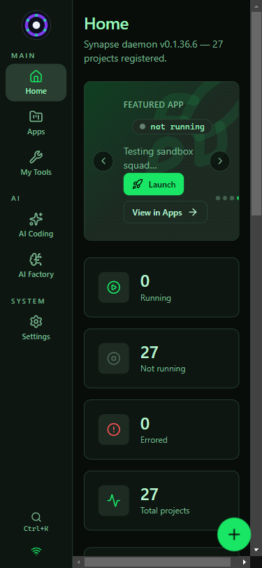
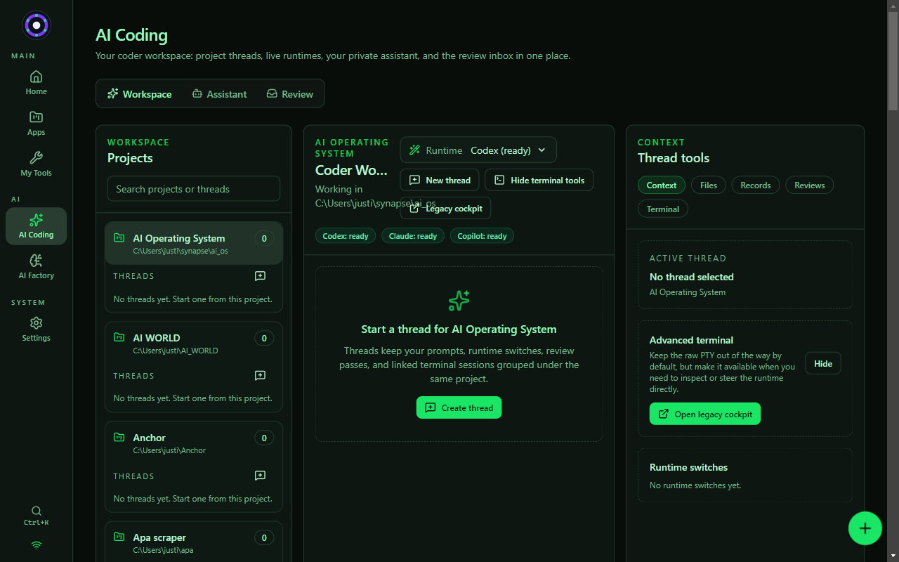
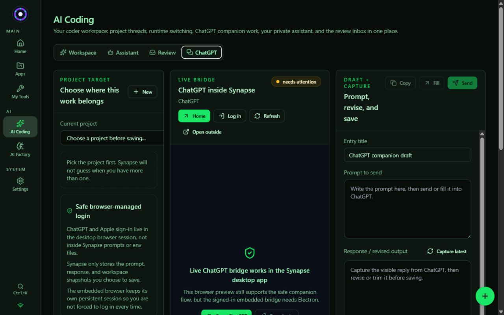
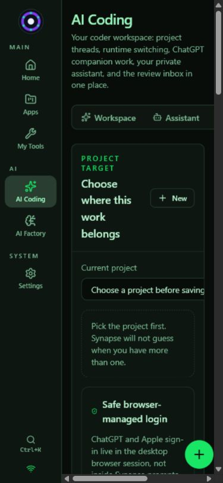
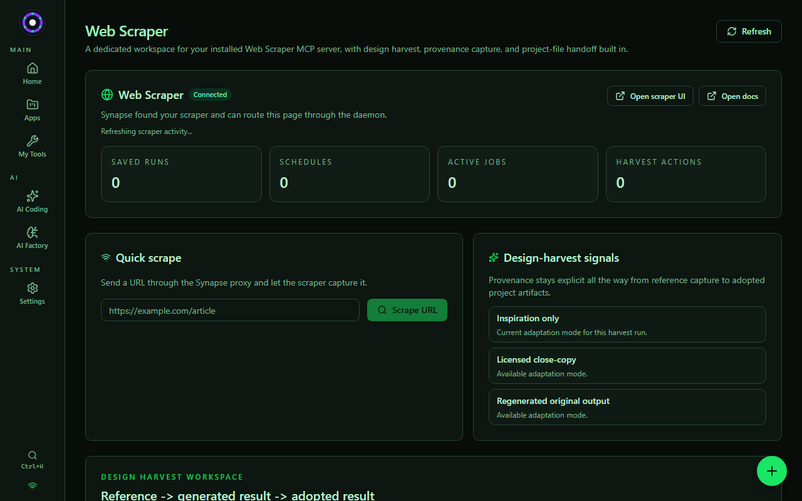
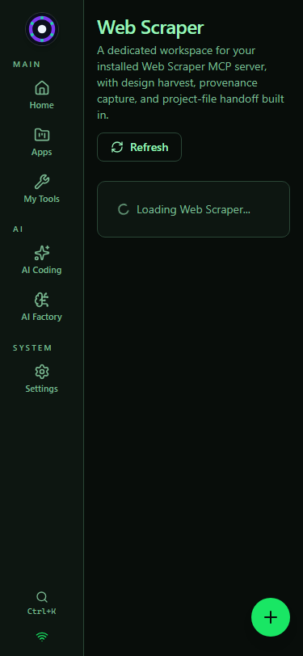
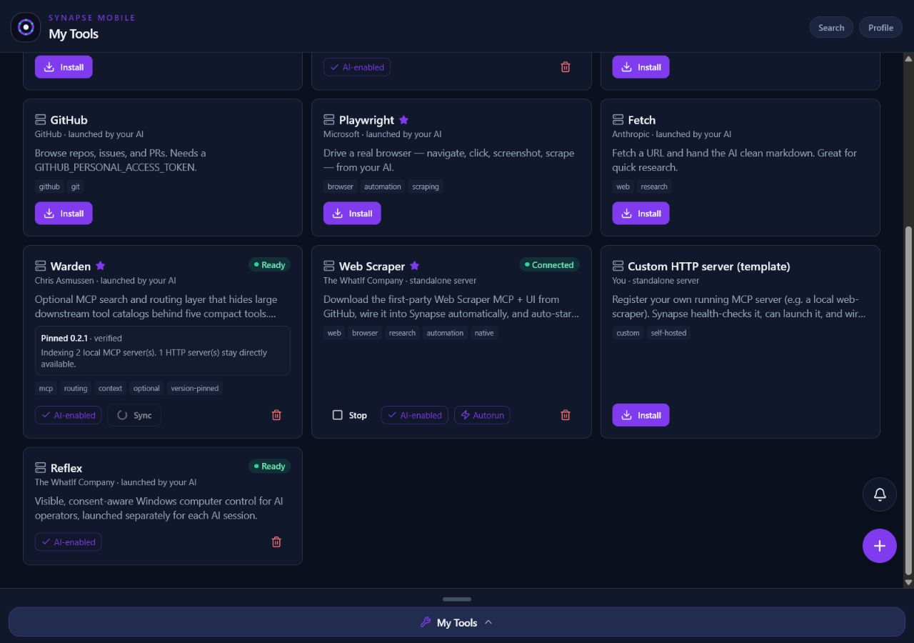
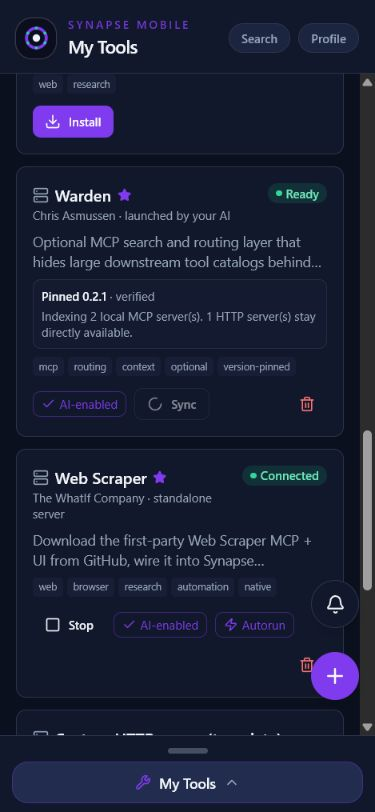
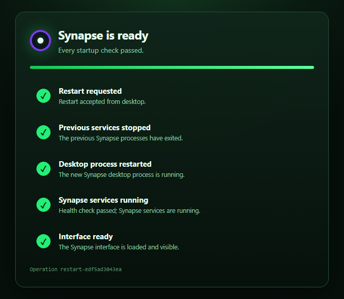

# Synapse — UI screenshots

Real screenshots of the running app, captured from the live renderer (Vite `:5173` + daemon `:7878`) via Playwright. **These evolve as Synapse is built** — when a change alters a user-visible surface, the affected image here is refreshed in the same commit (see the screenshot rule in `AGENTS.md`).

_The original gallery was captured 2026-07-06 against daemon `v0.1.37`. The Warden marketplace proof was captured 2026-07-31 against daemon `v0.1.90` after a real pinned download and verification. The restart proof was captured from the same native progress HTML exercised by a real `v0.1.91` Windows relaunch after every recorded stage passed. The ChatGPT companion captures honestly show the browser-preview fallback message; the signed-in embedded bridge runs in the desktop Electron app._

## Home — mission control (desktop, 1280×800)

Featured-app slideshow, running/not-running/errored counts, live recent-activity feed, "Jump in" quick actions, and the "Built for AI agents too" panel. "Connected to daemon" — real data rendering.

## Home — mobile (375×812)

## AI Coding — the coder cockpit (desktop, 1280×800)

Project-thread workspace focused on the bundled **Synapse Self** project, showing the self-improvement cockpit and the review-driven coding surface where UX/QA/token-efficiency/judge passes live.

## ChatGPT Companion — desktop (1280×800)

The new AI Coding sub-tab for browser-managed ChatGPT work: project-targeted save-back, draft/revise controls, and the live bridge area that upgrades to the signed-in embedded experience in the desktop app.

## ChatGPT Companion — mobile (375×812)

Phone-width proof for the same companion surface, captured at 375 px wide from the live renderer.

## Web Scraper — design harvest workspace (desktop, 1280×800)

The dedicated installed-page workspace for reference capture, provenance/adaptation labeling, generated component previews, and adopted project artifacts.

## Web Scraper — design harvest workspace (mobile, 375×812)

## Warden MCP marketplace — desktop (1280×900)

The optional Warden card is Ready at pinned version `0.2.1`, while the HTTP Web Scraper remains directly
connected beside it. The coverage summary confirms that direct local MCPs were indexed without replacing
their normal Synapse connections.

## Warden MCP marketplace — mobile (375×812)

Phone-width proof of the same verified Warden, direct Memory MCP, and directly connected Web Scraper
coexisting without horizontal overflow.

## Synapse restart verification — desktop (680×590)

The native startup/restart window after the daemon health probe and desktop renderer both passed. A real
Windows tray restart first upgraded the running app to `v0.1.91`; the instrumented follow-up persisted all
five stages as successful, closed this temporary window automatically, and left one healthy Synapse window.

### Verified finding (2026-07-05) — feeds the cockpit work

The cockpit still **works** but remains **project-scoped only**: you pick a registered project first, then start a thread inside it. The new Synapse Self project makes that workable for self-improvement, but the project-free "New chat" idea is still a real future polish target rather than something this wave solved.
